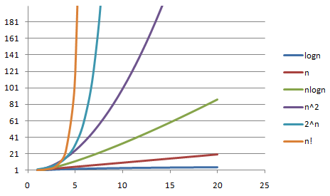

# Algorithm

According to its definition in Wikipedia, an algorithm is a finite sequence of well-defined, computer-implementable instructions, typically to solve a class of problems or to perform a computation.

## Growth Rate Of Function

For different algorithms, with the growth of the amount of input data, the increasing of the number of elementary operations is different. Thus, We can use the time complexity to describe it:

- the amount of time it takes to run an algorithm. Time complexity is commonly estimated by counting the number of elementary operations performed by the algorithm, supposing that each elementary operation takes a fixed amount of time to perform.

The chart as below illustrates their growth rate:

As we can see, `O(n!)` and `O(2^n)`'s growth rate is rapid to such a degree that in practical scenario, we can't accept an algorithm in these time complexity.

## Data Structure

## Divide-And-Conquer Method
