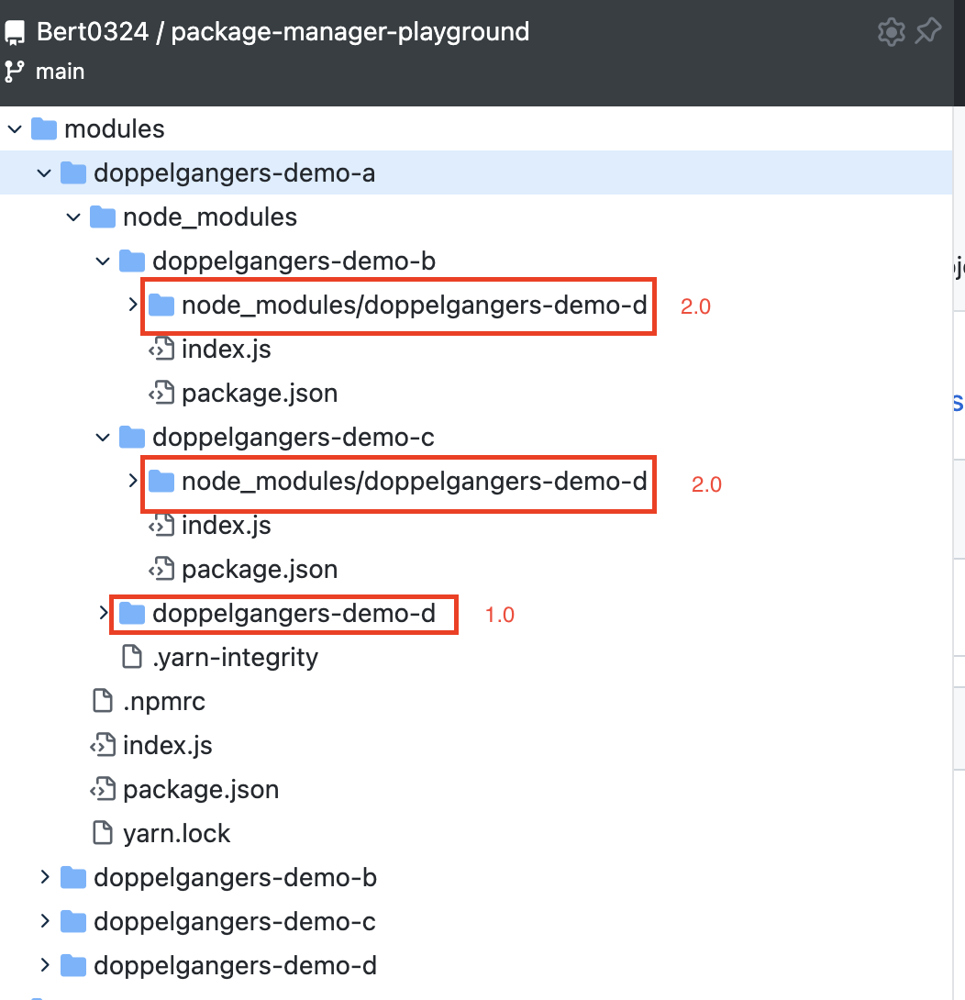
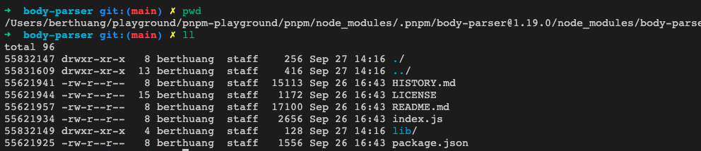
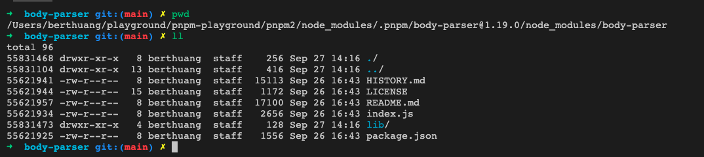
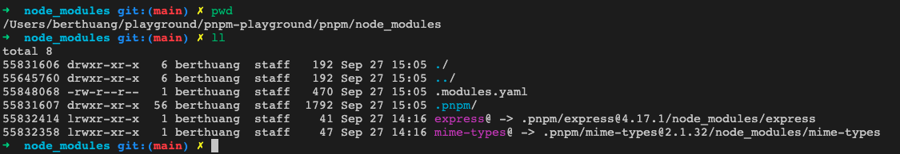
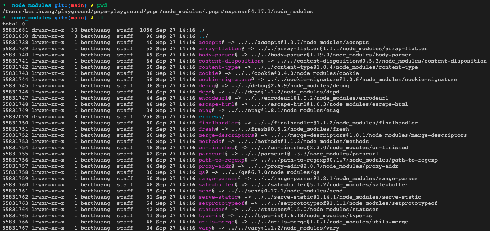
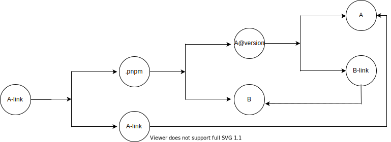

# Node Package Manager

除了npm，node还有很多其他的包管理工具。

因为node的模块系统用起来不那么舒服，所以才会出现了那么多包管理工具，八仙过海，各显神通。就连node的创作者都因为[对node的模块系统忍无可忍](https://www.youtube.com/watch?v=M3BM9TB-8yA&vl=en), 才去另起炉灶了[deno](https://deno.land/).

究其原因，还是因为node的递归向上查找模块机制，导致了包管理复杂度的急剧升高。

## Before Reading

本文的demo已经上传至git仓库[package-manager-playground](https://github.com/Bert0324/package-manager-playground). Demo使用了[corepack](https://nodejs.org/api/corepack.html), 如果你使用的node版本在16.9.0以上，那么不用额外安装yarn和pnpm, 同时只能使用指定的包管理工具.

先了解下node的模块管理机制, hard link和symlink之间的区别, 等基础知识, 可以更顺畅的阅读本文.

## Sore Points

对于现在基于npm/yarn的node模块安装, 个人感觉到最痛的点有以下这么几个。

### Phantom Dependencies


由于现在npm和yarn的flat策略，是可以在非显式声明的情况下去引入某些包的. 比如这个[项目](https://github.com/Bert0324/package-manager-playground/blob/main/yarn/index.js)不存在`body-parser`依赖声明，但是因为`express`包含了`body-parser`的依赖，所以可以直接引用`body-parser`.

虽然有时候这种特性非常方便，比如在满足版本的情况下，可以少添加一个包，甚至可以避免下面要说的doppelgangers问题，但是这毕竟是一种不规范的做法, 容易导致迷惑.

最糟糕的是, 很多非常流行的包, 由于对于运行(npm和yarn安装的前提下)并没有什么影响或者因为疏忽, 就使用了这种引用方式.

### Doppelgangers


做了一个[demo](https://github.com/Bert0324/package-manager-playground/tree/main/modules), 在npm上发布了四个奇怪的包，罪过罪过.....

可以看到，依赖关系是这样的：

```txt
a => b => d@2.0
a => c => d@2.0
a => d@1.0
```

最终，利用yarn装包后文件树是这样的：



可以看到，d的v2.0被安装了两次，尽管做了flat的算法，仍然有冗余的依赖安装。

### Dependencies Redundancy

这个也是老生常谈的问题，随着项目增多，node_modules碎片化分布, 占用内存的体积急剧变大，256g的开发机真的已经落后于时代了....

## `cargo`

没有对比就没有伤害，可以看一下rust的包管理工具[cargo](https://doc.rust-lang.org/stable/cargo/index.html)是怎么做的.

感觉rust和node的包管理, 在某些方面是有相似度的, 比如第三方都是提供源码然后本地统一编译, 统一的包管理等等.

先`git clone git@github.com:Bert0324/package-manager-playground.git`, 然后分别进入`/cargo`和`/modules/cargo_rename_demo`, 可以直观的看到文件结构.

### Global Store

cargo不会在每个项目中都安装依赖, 而是会在`~/.cargo`目录中安装第三方包.

运行`cargo install`和运行`npm install`也有区别, `cargo install`会在`~/.cargo`中安装对应依赖, 然后项目的依赖必须手动在`Cargo.toml`中添加, 同样遵循[semver规范](https://semver.org). 当`cargo build`和`cargo run`时会自动安装未安装的依赖.

由此, 避免了node中依赖碎片化的管理, 节省了内存空间.

### Disable Implicit Dependencies

类似其他的模块管理机制, rust中禁止隐式依赖, 即使是第三方包间接依赖的包, 只要没有显式的安装, 就是无法在项目中使用的.

### Rename Mod

类似[npm alias](https://github.com/npm/rfcs/blob/main/implemented/0001-package-aliases.md#rationale-and-alternatives)的能力.

rust支持相同模块的多版本共存, 参考此[Cargo.toml](https://github.com/Bert0324/package-manager-playground/blob/main/cargo/Cargo.toml).

### Why Cargo can

可以看到, rust的模块管理系统既兼顾了简洁和功能的丰富(反例是java全局class注册, 不方便简单的支持模块多版本), 又不至于过高的复杂度.

为什么rust可以, node就做的这么缺一口气呢? 感觉还是因为node的包引用机制: 递归向上查找模块.

相比起来, node模块机制虽然简单直观易上手, 而且在使用初期用户感知很少, 但是是一个扩展性不那么强的设计.

## pnpm

虽然node这么烂了，但是毕竟大家都在用了(而且用的竟然还有些顺手了), 所以出现了很多patch的方案.

其中[pnpm](https://github.com/pnpm/pnpm)比较新和成熟, 包括[cnpm](https://github.com/cnpm/cnpm)之类的方案也和其相似度很高, 可以作为一个典型去研究一下, 可以figure out他是去怎么解决这些痛点的.

先`git clone git@github.com:Bert0324/package-manager-playground.git`, 然后分别进入`/pnpm`和`/pnpm2`并`npm run bootstrap`, 可以重复下面的试验.

### Global Store => hard link

实现全局存储, pnpm的做法很有意思. 他不会和cargo一样, 去创建一个全局的`~/.pnpm`, 而是通过hard link去共享各个项目`.pnpm`内的模块依赖, 从而减小对内存的占用.

举一个比较直观的栗子, 在demo中, `/pnpm`和`/pnpm2`这两个项目中都依赖了同一个库`"body-parser": "1.19.0"`.

然后在`/pnpm/node_modules/.pnpm/body-parser@1.19.0/node_modules/body-parser`这个目录下运行`ls -alFi`, 可以看到:



也在`/pnpm2/node_modules/.pnpm/body-parser@1.19.0/node_modules/body-parser`这个目录下运行`ls -alFi`, 可以看到:



可以很直观的看到, 这两个包里的inode number是一模一样的, 说明是同一份文件的两份硬链接.

### Dependency Link  => symlink

在demo中, `/pnpm`这个项目依赖了`express`这个依赖, 如果去引用`body-parser`, 就会报错. 那么, pnpm究竟是如何去做这件事的呢?

首先, 进入`/pnpm/node_modules`, 然后`ls -alFi`, 可以看到:



其他包是不存在`/pnpm/node_modules`这个目录下的, 自然链接不到.

然后也可以看到, `express`这个包是被symlink去了`/pnpm/node_modules/.pnpm/express@4.17.1/node_modules/express`这个目录下, 那么express是怎么去找到自己的依赖的呢? 继续进入`/pnpm/node_modules/.pnpm/express@4.17.1/node_modules`这个目录下, 然后`ls -alFi`, 可以看到:



除了自己, 都被symlink到了`/pnpm/node_modules/.pnpm`这个目录下.

举一个比较直观的栗子, 对于一个经典的依赖关系:

```txt
a => b
```

他通过pnpm建立起的文件拓扑结构, 画出来有点乱(其实真的也有点复杂), 如下:



所以本质上, pnpm和npm/yarn是没有区别的, 也是会flat后放在`.pnpm`中, 但是他多做的一点是把文件通过symlink串联起来.

比较相似的是, yarn的workspace也是用symlink去统一依赖的, 可以看[此yarn源码](https://github.com/yarnpkg/yarn/blob/3119382885ea373d3c13d6a846de743eca8c914b/src/package-linker.js). 还有cnpm, 也是用类似的方案.

### When using pnpm

特别值得一提的是, pnpm的这种方式, 如果依赖的包写法不规范, 隐式依赖了一些包, 会导致依赖查询不到而报错. 那么就只能用npm/yarn去安装, 或者为pnpm cli加上[`--shamefully-hoist`](https://pnpm.io/npmrc#dependency-hoisting-settings).

此外, symlink的方式会导致一些IDE索引很久, 占用cpu, 在此特别推荐vscode作为配合.

## Thinking

时至今日, node都已经可以用`corepack`去指定包管理工具了, npm的地位已经不那么官方了. 如果node可以有更好的包管理方案, 意味着更小的包体积, 更简单的tree shaking逻辑, 那么对基于js开发的前后端的开发体验和用户体验, 都会有很大的提升.

但是其实, 个人觉得更科学的是[deno http import](https://deno.land/manual@v1.11.5/examples/import_export#remote-import)和[go http import](https://golang.org/doc/code#ImportingRemote)的方式, 更加符合一个前端的直觉.

同时, 可以思考用 esm + http import的方式, 把前端从webpack和node_modules中拯救出来, 充分利用类似[skypack](https://www.skypack.dev/)这类cdn的缓存, 对于整体的缓存率的提升会有很大的提升的.

## Reference

- pnpm博客: <https://pnpm.io/blog/2020/05/27/flat-node-modules-is-not-the-only-way>
- rushjs官网: <https://rushjs.io/>
- cargo官网: <https://doc.rust-lang.org/stable/cargo/index.html>
