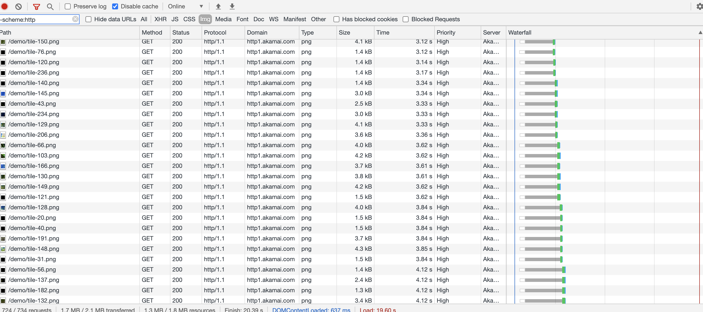
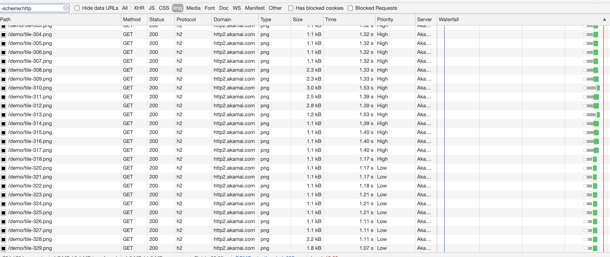

# Http2

setup http2 in nginx:

```nginx
server {
    listen 443 ssl http2;

    ssl_certificate server.crt;
    ssl_certificate_key server.key;
}
```

## Main New Features

See a [Demo by Akamai](https://http2.akamai.com/demo).

### header compression

In Http1.1, the header is plain text, of course, it is more easy for people to read, but it will cost lots of space when the header is large.

Even more, SSL will change the header as binary, which means it is actually necessary to show as plain text. So in Http2, the header becomes index with a static table. It will make each request smaller.

### multiplexing

In Http1.1, the transmission is parallel, therefore next file has to wait to be transferred until the last transmission is finished if `connection: keep-alive`, which obviously waste current bandwidth.

In Http2, it will transfer multiple files mixed in one connection. Each frame has its id, so the client is able to joint it to a full message.

See the differences between them:

http1.1:



http2:



### server push

Traditionally, when the client request index.html, server can only send index.html.

But in Http2, the server knows if the client load index.html, some resources, such as css or JS file will be requested, server can initiatively send these. 

For example, with nginx:

```nginx
location / {
    root   /usr/share/nginx/html;
    index  index.html index.htm;
    http2_push /style.css;
    http2_push /app.js;
}
```

## Reference

- <https://developers.google.com/web/fundamentals/performance/http2>
- <http://nginx.org/en/docs/http/ngx_http_v2_module.html>
