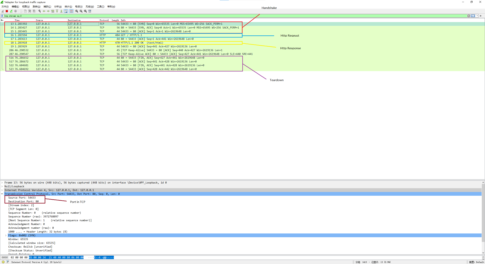

# TCP/IP

TCP/IP protocol can provide a reliable link between two computers, if packet get lost, it is re-transmitted. TCP itself rides on top of IP, which provides unified addressing to communicate between computers. TCP/IP is a basis for internet and 99% of other networks.

## Frame

### Flags Field

- URG—Indicates that some urgent data has been placed.
- ACK—Indicates that acknowledgement number is valid.
- PSH—Indicates that data should be passed to the application as soon as possible.
- RST—Resets the connection.
- SYN—Synchronizes sequence numbers to initiate a connection.
- FIN—Means that the sender of the flag has finished sending data.

## Connection Establishment

The setup steps make sure both of them can receive and send data to each other.

1. the client send a SYN to the server. In this step, the server knows it can receive data from the client.

2. the server replies with a SYN-ACK. In this step, the client knows it can receive data and send data to the server.

3. the client sends an ACK back to the server. In this step, the server knows the client can receive data it sent.

## Connection Termination

The termination uses a four-way handshake, with each side of the connection terminating independently.

Each side needs to send a FIN and ACK packet to another side. Therefore, a typical tear-down requires a pair of FIN and ACK segments from each TCP endpoint.

There is a picture to show it:

Why the initiator needs to wait for 2 maximum segment lifetime?

If the receiver doesn't get its ACK packet from the initiator, it will resend a FIN to the initiator. It can guarantee the connection can be teardown safely.

## Captured TCP package by Wireshark

As Http is over TCP, we can send a Http request and see its packages.

I typed an url in the browser and pressing enter. After the page was loaded, I closed the page. The Wireshark result is as below:

## Reference

- <https://topic.alibabacloud.com/a/tcp-three-time-font-colorredhandshakefont-and-four-times-wave-break_8_8_20230829.html>
- <https://www.vskills.in/certification/tutorial/information-technology/basic-network-support-professional/tcp-connection-establish-and-terminate/>
- <https://developer.mozilla.org/en-US/docs/Web/HTTP/Messages>
- <https://www.techrepublic.com/article/exploring-the-anatomy-of-a-data-packet/>
