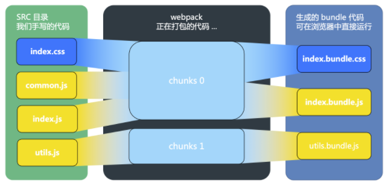

# Webpack Optimization

虽然在使用react或者vue的时候，cra和vue-cli已经配置好了绝大部分的选项，但是在调优和自己打包项目时，还是需要对webpack的一些配置有一些认识。

Optimization主要分为开发时的打包速度优化，和打包后的代码性能优化。

## Module, Chunk and Bundle

- **Module**: Discrete chunks of functionality that provide a smaller surface area than a full program. Well-written modules provide solid abstractions and encapsulation boundaries which make up a coherent design and clear purpose.

- **Chunk**: This webpack-specific term is used **internally** to manage the bundling process. Bundles are composed out of chunks, of which there are several types (e.g. entry and child). Typically, chunks directly correspond with the output bundles however, there are some configurations that don't yield a one-to-one relationship.

- **Bundle**: Produced from a number of distinct modules, bundles contain the final versions of source files that have already undergone the loading and compilation process.

## Optimization Of Packaging

- 使用高版本的webpack和node
- [thread-loader](https://github.com/webpack-contrib/thread-loader): 多进程池打包优化，放在每个load rule的最前面。对一些小项目甚至可能会打包的更慢，所以cra不会默认开启
- load rule里的`exclude`和`include`, 尽量忽略不需要打包的模块
- `resolve`中的几个选项，`resolve.modules`指明第三方模块的绝对路径，`resolve.mainFields`减少搜索步骤，`resolve.extensions`尽可能减少后缀尝试的可能性, `noParse`忽略不需要打包的第三方库
- `babel-loader`开启缓存
- 合理选择[`devtool`](https://webpack.js.org/configuration/devtool/)策略，比如`source-map`就是最慢的，但是可以百分百追踪source，如果想构建更快，在可接受的范围内可以选择一些cheap的策略。但是尽量避免使用`inline-`和`eval-`, 因为会让bundle体积变大

## Optimization Of Bundle Performance

- mode设置为`production`
- 小图用`url-loader`变为base64
- `splitChunks`减小包体积，和增加不变代码缓存率
- `optimization`里的`terser-webpack-plugin`, 对js压缩
- `mini-css-extract-plugin`抽取css并压缩，提高缓存率
- [lazy load](https://webpack.js.org/guides/lazy-loading/): 使用es6的`import`方法引入模块，webpack支持自动代码分割，可以提升首屏性能
- [tree shaking](https://webpack.js.org/guides/tree-shaking/): 可以移除未使用的代码。但是必须满足一些条件：使用esm和`package.json`中设置`sideEffects`
- [scope hoisting](https://webpack.docschina.org/plugins/module-concatenation-plugin/): 开启scope hoisting后代码会被直接注入，减少了函数开销和代码体积。但是和tree shaking一样，虽然`mode: "production"`中`ModuleConcatenationPlugin`默认开启`concatenateModules`, 但是只对esm起作用。

## Webpack Tools

- [`webpack-bundle-analyzer`](https://github.com/webpack-contrib/webpack-bundle-analyzer): 对bundle体积大小分析可视化工具
- [`size-plugin`](https://github.com/GoogleChromeLabs/size-plugin): 对包大小变化监控的工具
- [`webpack-merge`](https://github.com/survivejs/webpack-merge): 多份配置合并工具

## React Webpack Options

- 可以eject出配置，但是不支持，因为不能随着[`react-scripts`](https://github.com/facebook/create-react-app/tree/master/packages/react-scripts)升级，所以不推荐，但是自由度可以说是最高的
- 使用[`react-app-rewired`](https://github.com/timarney/react-app-rewired), 在`config-overrides.js`中添加配置，把指令从`react-scripts`改为`react-app-rewired`
- 使用[`customize-cra`](https://github.com/arackaf/customize-cra), 改一些有限的小配置比较方便

## Vue Webpack Options

在`vue.config.js`中添加要改写的配置。

## Reference

- <https://juejin.cn/post/6844904094281236487>
