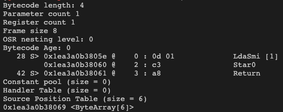

# V8 Byte Code

## Nodejs

```javascript
// test.js
function bytecodeTest() {
  var a = 1;
}
bytecodeTest();
```

```shell
node --print-bytecode test.js | grep 'generated bytecode for function: bytecodeTest' -A 100
```



## Reference
