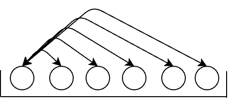

# 1. Two Sum

source: <https://leetcode.com/problems/two-sum/>

## Question

Given an array of integers nums and an integer target, return indices of the two numbers such that they add up to target.

You may assume that each input would have exactly one solution, and you may not use the same element twice.

You can return the answer in any order.

## 暴力法

遍历两个数组，在index不一致的情况下找出合为target的组合。

很明显，时间复杂度是O(n2)，空间复杂度是O(1).

在时间复杂度上来说是非常昂贵的。

```rs
pub fn two_sum(nums: Vec<i32>, target: i32) -> Vec<i32> {
    let mut ret = [].to_vec();
    for (index1, v1) in nums.iter().enumerate() {
        for (index2, v2) in nums.iter().enumerate() {
            if (v1 + v2) == target && index1 != index2 {
                ret.push(index1 as i32);
                ret.push(index2 as i32);
                return ret;
            }
        }
    }
    ret
}
```

## 暴力法的优化

在上述的暴力法中，有很多重复的计算。

对于数组中的某个元素，他和数组中的其他元素的match如下：



不用每次从头比对，从本次比对元素的那个位置开始就可以：

```rs
fn two_sum(nums: Vec<i32>, target: i32) -> Vec<i32> {
    let mut ret = [].to_vec();
    for (index1, v1) in nums.iter().enumerate() {
        for (index2, v2) in nums.iter().enumerate().filter(|&(i, _)| i > index1) {
            if (v1 + v2) == target {
                ret.push(index1 as i32);
                ret.push(index2 as i32);
                return ret;
            }
        }
    }
    ret
}
```

当然，时间复杂度仍然是O(n2)，并没有本质上的改变。

## 哈希表

因为有两个nested for loop，所以时间复杂度才会这么高。

那么要降低时间复杂度，最直接的思路就是 loop => hash，理想状态下的hashmap的时间复杂度是O(1)。

在loop的过程中，存在自身的kv，在接下来的寻找中就可以用kv的方式查看。

```rs
fn two_sum(nums: Vec<i32>, target: i32) -> Vec<i32> {
    use std::collections::HashMap;
    let mut kv = HashMap::<i32, usize>::new();
    for (index1, value) in nums.iter().enumerate() {
        let index2 = kv.get(&(target - value));
        match index2 {
            Some(i) => return [(*i) as i32, index1 as i32].to_vec(),
            None => {
                kv.insert(*value, index1);
            },
        }
    }
    [].to_vec()
}
```

时间复杂度是O(n), 空间复杂度也是O(n).

## 总结

在优化时间复杂度的时候，针对数组，可以优先考虑利用hashmap去提升便利效率，利用空间换时间。
