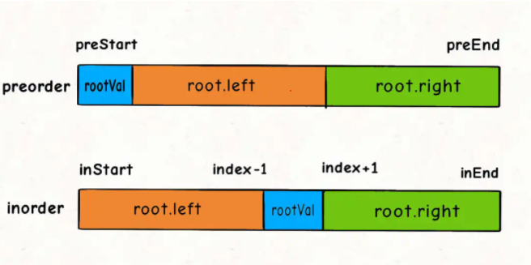
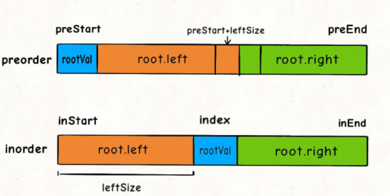
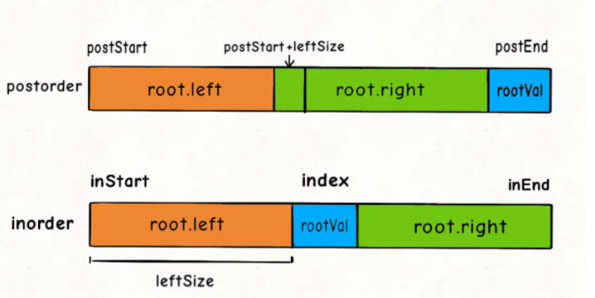

# 105 & 106

## 105. Construct Binary Tree from Preorder and Inorder Traversal

source: <https://leetcode.com/problems/construct-binary-tree-from-preorder-and-inorder-traversal/>

### Question

Given two integer arrays preorder and inorder where preorder is the preorder traversal of a binary tree and inorder is the inorder traversal of the same tree, construct and return the binary tree.

### 思路

这道题其实没啥初想法，拿到手了以后一脸蒙蔽。唯一的念头就是是否能把这两个数组转换为层序遍历的形式，然后用类似297题的思路去解。但是没有一个明确的思路。

后来看了labuladong的这篇文章： <https://mp.weixin.qq.com/s?__biz=MzAxODQxMDM0Mw==&mid=2247487270&idx=1&sn=2f7ad74aabc88b53d94012ceccbe51be>，感觉讲解的很好。主要的思路还是要去分析这两种遍历模式之间的区别。

实际的解题书写过程中，要特别注意熟练掌握index和length之间的关系，不然很容易写错，最好把图都画出来。




```rs
pub fn build_tree(preorder: Vec<i32>, inorder: Vec<i32>) -> Option<Rc<RefCell<TreeNode>>> {
    if preorder.is_empty() {
        return None;
    }
    fn build(
        i1: usize,
        i2: usize,
        i3: usize,
        i4: usize,
        preorder: &Vec<i32>,
        inorder: &Vec<i32>,
    ) -> Option<Rc<RefCell<TreeNode>>> {
        if i1 > i2 {
            return None;
        }
        let root_val = preorder[i1];
        let mut index = 0;
        for (i, v) in inorder.iter().enumerate() {
            if *v == root_val {
                index = i;
                break;
            }
        }
        let left_size = index - i3;
        let mut root = TreeNode::new(root_val);
        root.left = build(i1 + 1, i1 + left_size, i3, index - 1, preorder, inorder);
        root.right = build(i1 + left_size + 1, i2, index + 1, i4, preorder, inorder);
        return Some(Rc::new(RefCell::new(root)));
    }
    let end_index = preorder.len() - 1;
    build(0, end_index, 0, end_index, &preorder, &inorder)
}
```

## 106. Construct Binary Tree from Inorder and Postorder Traversal

source: <https://leetcode.com/problems/construct-binary-tree-from-inorder-and-postorder-traversal/>

### Question

Given two integer arrays inorder and postorder where inorder is the inorder traversal of a binary tree and postorder is the postorder traversal of the same tree, construct and return the binary tree.

### 初想法

有了105题的经验，这题的思路很明显也会往dfs的方向去思考。

```rs
pub fn build_tree(inorder: Vec<i32>, postorder: Vec<i32>) -> Option<Rc<RefCell<TreeNode>>> {
    if inorder.is_empty() {
        return None;
    }
    fn build(
        i1: i32,
        i2: i32,
        i3: i32,
        i4: i32,
        inorder: &Vec<i32>,
        postorder: &Vec<i32>,
    ) -> Option<Rc<RefCell<TreeNode>>> {
        if i1 > i2 {
            return None;
        }
        let root_val = postorder[i2 as usize];
        let mut index: i32 = 0;
        for (i, v) in inorder.iter().enumerate() {
            if *v == root_val {
                index = i as i32;
                break;
            }
        }
        let left_size = index as i32 - i3;
        let mut root = TreeNode::new(root_val);
        println!("i1:{},i2:{},left_size:{}", i1, i2, left_size);
        root.left = build(i1, i1 + left_size - 1, i3, index - 1, inorder, postorder);
        root.right = build(i1 + left_size, i2 - 1, index + 1, i4, inorder, postorder);
        return Some(Rc::new(RefCell::new(root)));
    }
    let end_index = inorder.len() as i32 - 1;
    build(0, end_index, 0, end_index, &inorder, &postorder)
}
```

把图画出来就会很好做：



特别要注意一点，index的运算要用i32，因为在退出条件时index参数可能为负数，如果用usize，运算符溢出就会导致退出条件失效。

## 总结

这种题很明显要先熟悉前、中、后这种常见的遍历，然后在他们之中找规律，完成解题。

同时注意基本功的积累。
