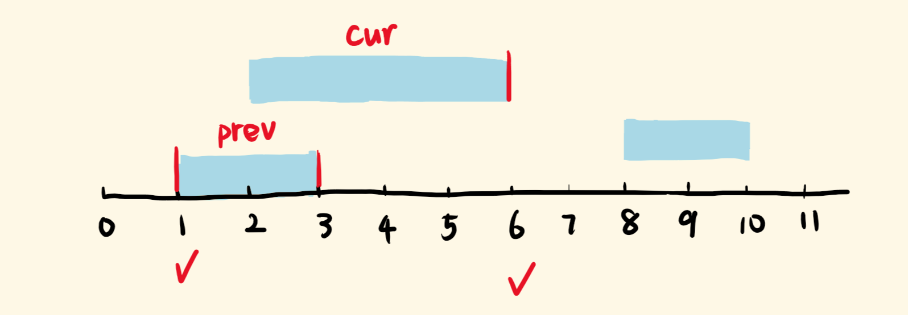

# 56. Merge Intervals

source: <https://leetcode.com/problems/merge-intervals/>

## Question

Given an array of intervals where intervals[i] = [starti, endi], merge all overlapping intervals, and return an array of the non-overlapping intervals that cover all the intervals in the input.

## 思路

这题看到的第一反应是去把数组中的元素补齐，去重后然后合并区间，但是对于`[1,4][5,6]`和`[1,5][5,6]`这种case没有太好的区分方法，只好作罢。

后续的思路是排序后根据重合区间来做，如图：



```js
/**
 * @param {number[][]} intervals
 * @return {number[][]}
 */
var merge = function (intervals) {
  const ret = [];
  // 根据起始位置排序
  intervals.sort((a, b) => a[0] - b[0]);
  let prev = intervals[0];
  for (let i = 0; i < intervals.length; i++) {
    // 区间重合
    if (prev[1] >= intervals[i][0]) {
      prev[1] = Math.max(intervals[i][1], prev[1]);
      // 区间不重合
    } else {
      ret.push(prev);
      prev = intervals[i];
    }
  }
  // 最后一个区间遇不到和他不重合的区间，手动push
  ret.push(prev);
  return ret;
};
```

## End

遇到重合区间的问题，可以想一下如果巧妙的使用排序，同时注意细节。
