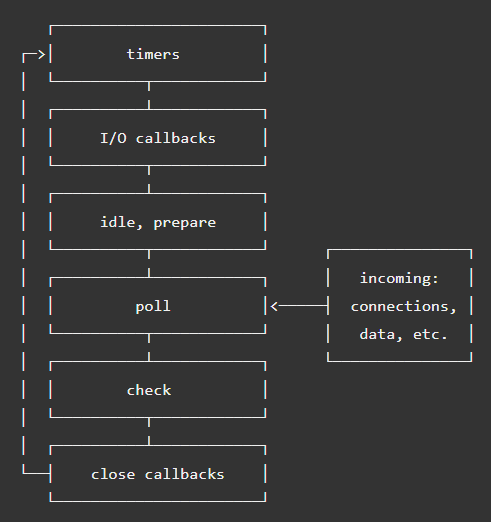

# Event Loop

JavaScripts' biggest feature is its event loop, because of it, we can ignore details of threads and focus on those codes which can create real worth.

Event loop is responsible for executing the code, collecting and processing events, and executing queued sub-tasks.

## Tasks and MicroTasks

A **task** is any JavaScript scheduled to be run by the standard mechanisms such as initially starting to execute a program, an event triggering a callback, and so forth.

Compared to task, **microtasks** will be executed until its queue is empty.

The sequence is like:

- **clear one task** => **clear all microtasks** => **clear one task** => **clear all microtasks** ....

Microtasks includes `Promise`, `queueMicrotask`, `MutationObserver` and `process.nextTick` on Node.js.

There is a typical codes to show it:

```ts
setTimeout(_ => console.log(4));

new Promise(resolve => {
  resolve()
  console.log(1)
}).then(_ => {
  console.log(3)
});

console.log(2);

// 1 2 3 4
```

## In Browser

In modern browsers, there are 3 different types of event loop is running.

### Window Event Loop

It drives all of the windows sharing a similar origin.

### Worker event loop

 It includes all forms of workers, such as web worker, shared workers and service workers. Workers are kept in one or more agents that are separate from the "main" code; the browser may use a single event loop for all of the workers of a given type or may use multiple event loops to handle them.

### Worklet Event Loop

A worklet event loop is the event loop used to drive agents which run the code for the workelets for a given agent. This includes worklets of type Worklet, AudioWorklet, and PaintWorklet.

## Node.js

In Node.js, event loop is quite different from browsers. As it don't have render tasks and have more I/O tasks.

When Node.js starts, it initializes the Event loop, processes the provided input script which may make async API calls, then begins processing the Event loop.

There is only one thread and that is the thread Event loop runs on. Event loop works in a cyclical order, with different phases. The order of operation of Event loop is shown below.



- **timers**: this phase executes callbacks scheduled by setTimeout() and setInterval().
- **pending callbacks**: executes I/O callbacks deferred to the next loop iteration.
- **idle, prepare**: only used internally.
- **poll**: retrieve new I/O events; execute I/O related callbacks (almost all with the exception of close callbacks, the ones scheduled by timers, and setImmediate()); node will block here when appropriate.
- **check**: setImmediate() callbacks are invoked here.
- **close callbacks**: some close callbacks, e.g. socket.on('close', ...).

### Poll

The poll phase has two main functions:

1. Calculating how long it should block and poll for I/O, then
2. Processing events in the poll queue.

When the event loop enters the poll phase and there are no timers scheduled, one of two things will happen:

- If the poll queue is not empty, the event loop will iterate through its queue of callbacks executing them synchronously until either the queue has been exhausted, or the system-dependent hard limit is reached.

- If the poll queue is empty, one of two more things will happen:

    1. If scripts have been scheduled by setImmediate(), the event loop will end the poll phase and continue to the check phase to execute those scheduled scripts.

    2. If scripts have not been scheduled by setImmediate(), the event loop will wait for callbacks to be added to the queue, then execute them immediately.

Once the poll queue is empty the event loop will check for timers whose time thresholds have been reached. If one or more timers are ready, the event loop will wrap back to the timers phase to execute those timers' callbacks.

## Reference

- <https://developer.mozilla.org/en-US/docs/Web/JavaScript/EventLoop>
- <https://developer.mozilla.org/en-US/docs/Web/API/HTML_DOM_API/Microtask_guide/In_depth>
- <https://javascript.info/microtask-queue>
- <https://nodejs.org/en/docs/guides/event-loop-timers-and-nexttick/>
- <https://stackoverflow.com/questions/47724811/why-setimmediate-execute-before-fs-readfile-in-nodejs-event-loops-works>
