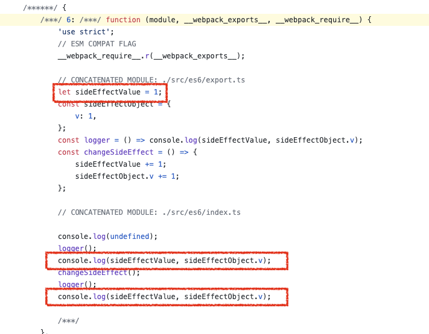
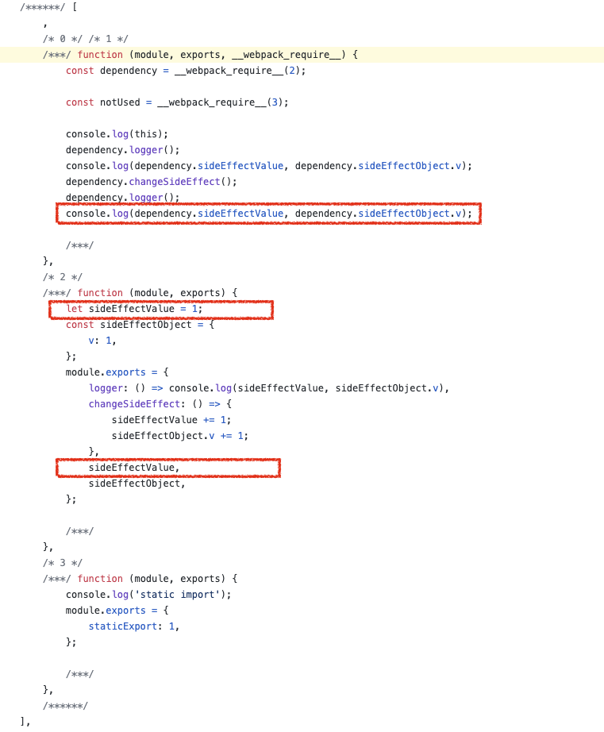
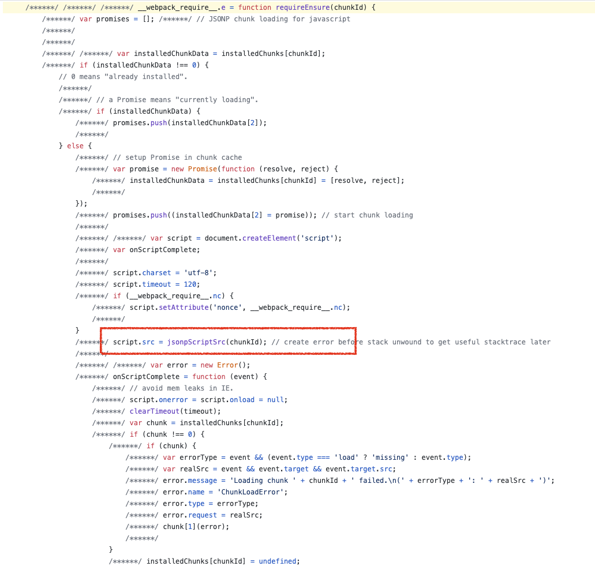
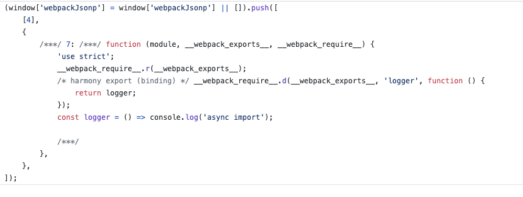

# JS模块化实战

不说一些虚的概念，我们只看最后的执行代码。为了更好的体验场景，推荐clone一下[webpack-module-demo](https://github.com/Bert0324/webpack-module-demo)，实际跑一下看下结果～～～

`git clone https://github.com/Bert0324/webpack-module-demo.git`

## Why we need Module in JS

可以参考一下webpack对于module的定义，虽然webpack的module和js的module还是有区别的，但是从内核上讲我觉得是一样的：

- Discrete chunks of functionality that provide a smaller surface area than a full program. Well-written modules provide solid abstractions and encapsulation boundaries which make up a coherent design and clear purpose.

提供了一个更小表面积的离散功能块。相比于一大坨程序写在一起，module可以帮助我们拆分和组织代码。

特别的是，和其他语言不同，js的模块必须同时考虑本地加载和浏览器加载这两种情况。因为这二者的差异和特点，衍生出了同步异步，执行时机等不同。这二者核心的不同，我觉得还是io速度的不同，以下有一个对比：


## CommonJS

CommonJS一开始主要用于Node端的模块化方案, 特点是同步/阻塞式加载，使用时加载。关于CommonJS可以参考下这篇[文章](https://github.com/Bert0324/code-playground/blob/master/js/node_mo.md)。

CommonJS很受欢迎，那我们能不能在浏览器端也使用类似的加载方法？于是有了AMD和CMD。

## Async Module Definition and RequireJS

RequireJS是AMD规范的一个实现（最开始接触js的时候我还以为RequireJS是CommonJS的实现）。和CommonJS不同，AMD是专门为浏览器环境设计的。

一个典型的使用如下：

```ts
define(['dependency1', 'dependency2'], (dependency1, dependency2) => {
    // dependency1 and dependency2 两个模块此时已经被下载并执行完了
});

// 使其贴近CommonJS的一个sugar
define(['require', 'dependency1', 'dependency2'], (require) => {
    // 看起来和CommonJS差不多，但是其实执行时机完全不同
    const dependency1 = require('dependency1');
    const dependency2 = require('dependency2');
});
```

通过`define`函数将模块都加载在闭包中，避免了全局污染，加载时有几个特点：

1. 依赖前置，所有的依赖会被预先在一块声明
2. 加载完的回调函数会在所有模块被下载完并执行好之后再执行

## Common Module Definition and SeaJS

SeaJS是CMD规范的一个实现，算是对AMD规范的一个加强，起源于国内用的比较多的也是国内，作者是[玉伯](https://lifesinger.wordpress.com/), 语雀就是他团队的作品之一，他有一篇关于[模块化的文章](https://github.com/seajs/seajs/issues/588)，深扒了以下模块化的历史。

显而易见，AMD所有模块都要预先加载执行，对于那些暂时不用的模块，造成了浪费，对于执行时机也很容易造成一些confuse的地方。

一个典型的使用如下：

```ts
define((require, exports, module) => {
    // dependency1执行完之后才会执行dependency2
    const dependency1 = require("dependency1");
    const dependency2 = require("dependency2");
});
```

和AMD相比，CMD会在解析完主文件的模块之后再都预先下载完所有模块，但是模块的执行，会在其被require之后再被执行。

## Universal Module Definition

CommonJS和AMD是针对不同平台的，为了让一份代码可以兼容两个平台（其实这需求个人感觉蛮奇怪的），就有了UMD规范。其实实现相当简单，我们可以看一下webpack当把`output.libraryTarget`设定为umd时输出的代码，完整代码可见[这里](https://github.com/Bert0324/webpack-module-demo/blob/main/dist/library.min.js#L1)：

```js
(function webpackUniversalModuleDefinition(root, factory) {
	if(typeof exports === 'object' && typeof module === 'object')
		module.exports = factory();
	else if(typeof define === 'function' && define.amd)
		define([], factory);
	else if(typeof exports === 'object')
		exports["webpack-module-demo"] = factory();
	else
		root["webpack-module-demo"] = factory();
})(window, function(){})
```

首先会判断以下`exports`和`module`是否存在(CommonJS规范是否可用, 或者说是不是node环境), 如果不是，会再检查是不是有amd加载方法，如果还没有，会检查`exports`这个对象是否存在，如果都没，最后挂在`window`下面。

## ES6 Module

和CommonJS，AMD，CMD，UMD不同，ES6是JS自己本身的规范，但是鉴于浏览器支持性的不足，现在绝大部分es6 module的代码仍然会被编译成兼容性更好的代码，从这个角度讲，es6 module和前面的这几个规范，又没有本质性的不同。

es6 module和CommonJS最大的区别包括：

1. CommonJS模块输出的是一个值的拷贝，ES6 模块输出的是值的引用
2. CommonJS 模块是运行时加载，ES6 模块是编译时输出接口

说起来其实有点抽象，我们来实际对比一下webpack输入的代码，看一下他们实现上的差异到底是什么。

### CommonJS模块输出的是一个值的拷贝，ES6 模块输出的是值的引用

在[webpack-module-demo](https://github.com/Bert0324/webpack-module-demo)中`yarn build`。 然后分别`MODULE=es6 yarn dev`和`MODULE=commonJS yarn dev`, 在控制台上看结果。可以看到es6中`sideEffectValue`中的值被改变了，但是commonJS中没有。

es6模块的[源代码](https://github.com/Bert0324/webpack-module-demo/blob/main/src/es6/index.ts)和[输出代码](https://github.com/Bert0324/webpack-module-demo/blob/main/dist/es6.min.js#L96)， 和用CommonJS模块的[源代码](https://github.com/Bert0324/webpack-module-demo/blob/main/src/commonJs/index.ts)和[输出代码](https://github.com/Bert0324/webpack-module-demo/blob/main/dist/commonJS.min.js#L98)。

 我们可以看到，es6编译后的代码是在同一个函数作用域下面的，对于`sideEffectValue`这个export，引用的地方是直接使用的:

 

但是CommonJS编译后的代码，必须首先挂在一个`Object`上，然后才能引用:

 

这样就很明显了，说人话，他们之间的区别，就是在直接引用值对象上的区别，就像JS中引用对象和值对象被引用时的区别一样。

### CommonJS 模块是运行时加载，ES6 模块是编译时输出接口

从上一段我们可以看到CommonJS其实加载的是一个对象，这个对象只有在脚本运行时才会生成，而且只会生成一次，所以是运行时加载。

CommonJS是肯定会执行模块全文，但是es6就不一定。

在[webpack-module-demo](https://github.com/Bert0324/webpack-module-demo)中`yarn serve`， 在node端运行es6模块的[源代码](https://github.com/Bert0324/webpack-module-demo/blob/main/src/es6/index.ts)和CommonJS模块的[源代码](https://github.com/Bert0324/webpack-module-demo/blob/main/src/commonJs/index.ts)，可以看到对于没有使用的引入模块，es6没有执行但CommonJS执行了。

但是，在浏览器端，情况就会比较不同。在[webpack-module-demo](https://github.com/Bert0324/webpack-module-demo)中分别`MODULE=es6 yarn dev`和`MODULE=commonJS yarn dev`, 在控制台上看结果, 可以看到现在的结果和node上的结果是一样的。

现在我们把`package.json`里的`sideEffects`设为`true`，结果就是es6和CommonJS的执行结果是一样的。这就是webpack的[tree shaking](https://webpack.js.org/guides/tree-shaking/), 其实[scope hosting](https://webpack.js.org/plugins/module-concatenation-plugin/)也是基于es6的静态分析。

## webpack异步加载

从异步加载的[源代码](https://github.com/Bert0324/webpack-module-demo/blob/main/src/asyncImport/index.ts)编译成后的[目标代码](https://github.com/Bert0324/webpack-module-demo/blob/main/dist/asyncImport.min.js#L76)中，我们可以看到`__webpack_require__.e`这个相比其他目标代码多出来的方法(其实从注释中就可以看出来), 添加一个`<script>`标签，然后用jsonp的方式加载：

 

在被拆分出的[代码块](https://github.com/Bert0324/webpack-module-demo/blob/main/dist/4.min.js)中可以看到，通过全局对象`webpackJsonp`推入加载新的模块:

 

## Reference

- <http://huangxuan.me/2015/07/09/js-module-7day/>
- <https://github.com/seajs/seajs/issues/588>
- <http://www.ecma-international.org/ecma-262/6.0/#sec-imports>
