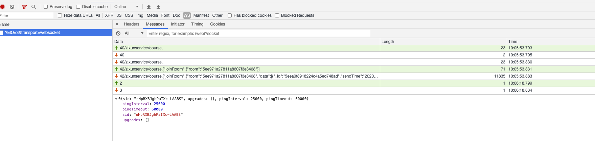

# WebSocket

WebSocket和Http协议一样，都是在tcp协议上的应用层协议。而和Http协议不一样的是，WebSocket可以在**单条**tcp连接上进行**全双工**通信。

## Features

- [全双工](https://zh.wikipedia.org/wiki/%E9%9B%99%E5%B7%A5#%E5%85%A8%E9%9B%99%E5%B7%A5)

这意味这要实现ws协议，必须要允许两台设备**同时**进行双向数据传输。客户端可以发送data payload给服务端，服务端同时也可以发送data payload给客户端。

- 单条请求

在Http/1.1中，已经有keep-alive请求头，多个http请求可以使用同一条tcp连接。但是这种情况下每条http请求还是必须要带上自己的请求头，而在ws协议中，只有一开始的握手需要传输请求头( 也会有用户登录后登录态不能及时更新的问题)。

## 帧

*在握手成功后，传输的就是数据帧(frame)了，由1个或多个帧组成一条完整的消息(message)。*

*发送端将消息切割成多个帧，并发送给服务端，接收端接收消息帧，并将关联的帧重新组装成完整的消息。*

ws数据帧的[统一格式](https://tools.ietf.org/html/rfc6455#section-5.2)如下：

```text
  0                   1                   2                   3
  0 1 2 3 4 5 6 7 8 9 0 1 2 3 4 5 6 7 8 9 0 1 2 3 4 5 6 7 8 9 0 1
 +-+-+-+-+-------+-+-------------+-------------------------------+
 |F|R|R|R| opcode|M| Payload len |    Extended payload length    |
 |I|S|S|S|  (4)  |A|     (7)     |             (16/64)           |
 |N|V|V|V|       |S|             |   (if payload len==126/127)   |
 | |1|2|3|       |K|             |                               |
 +-+-+-+-+-------+-+-------------+ - - - - - - - - - - - - - - - +
 |     Extended payload length continued, if payload len == 127  |
 + - - - - - - - - - - - - - - - +-------------------------------+
 |                               |Masking-key, if MASK set to 1  |
 +-------------------------------+-------------------------------+
 | Masking-key (continued)       |          Payload Data         |
 +-------------------------------- - - - - - - - - - - - - - - - +
 :                     Payload Data continued ...                :
 + - - - - - - - - - - - - - - - - - - - - - - - - - - - - - - - +
 |                     Payload Data continued ...                |
 +---------------------------------------------------------------+
```

如果FIN是1，这是message的最后一个分片，如果是0，则不是。

opcode来区分操作的类型。比如0x8表示断开连接，0x0-0x2表示数据交互(其中0x1是文本，0x2是二进制)。

mask表示负载数据是否被掩码，如果设置为 1，那么负载数据应该按照后面的 Masking-key 解码。

点击B站的某个视频之后的ws连接，他们应该是把对象stringify后转换成了`ArrayBuffer`之后，直接emit，所以opcode是2:


```ts
00000000: 0000 0062 0012 0001 0000 0007 0000 0001  ...b............
00000001: 0000 7b22 726f 6f6d 5f69 6422 3a22 7669  ..{"room_id":"vi
00000002: 6465 6f3a 2f2f 3431 3337 3632 3334 332f  deo://413762343/
00000003: 3231 3233 3634 3938 3722 2c22 706c 6174  212364987","plat
00000004: 666f 726d 223a 2277 6562 222c 2261 6363  form":"web","acc
00000005: 6570 7473 223a 5b31 3030 302c 3130 3135  epts":[1000,1015
00000006: 5d7d                                     ]}
```

## 心跳

*WebSocket 为了保持客户端、服务端的实时双向通信，需要确保客户端、服务端之间的 TCP 通道保持连接没有断开。然而，对于长时间没有数据往来的连接，如果依旧长时间保持着，可能会浪费包括的连接资源。*

但不排除有些场景，客户端、服务端虽然长时间没有数据往来，但仍需要保持连接。这个时候，可以采用心跳来实现。

发送方 -> 接收方：ping
接收方 -> 发送方：pong
ping、pong 的操作，对应的是 WebSocket 的两个控制帧，opcode分别是0x9、0xA。

有一点，心跳的间隔如果超过了60s，需要额外设置Nginx的两个[`proxy_read_timeout`](https://nginx.org/en/docs/http/ngx_http_proxy_module.html#proxy_read_timeout), [`proxy_send_timeout`](https://nginx.org/en/docs/http/ngx_http_proxy_module.html#proxy_send_timeout)，默认都是60s自动断开连接，需要大于心跳的间隔。

同时，`socket.io`可以在服务端设置`pingInterval`(ping的间隔)和`pingTimeout`(ping之后多久没收到pong自动断开连接), 在握手成功后，服务端会把这两个参数和`sid`马上发到客户端, 目的是让客户端和服务端的`pingInterval`和`pingTimeout`保持一致。



## 请求头

- Connection: Upgrade：表示要升级协议
- Upgrade: websocket：表示要升级到 websocket 协议
- Sec-WebSocket-Version: 13：表示 websocket 的版本。如果服务端不支持该版本，需要返回一个Sec-WebSocket-Versionheader，里面包含服务端支持的版本号。
- Sec-WebSocket-Key：与后面服务端响应首部的Sec-WebSocket-Accept是配套的，提供基本的防护，比如恶意的连接，或者无意的连接

两个和升级有关的请求头`Connection`和`Upgrade`, 都是hop-by-hop headers, 所以在nginx转发的时候都要额外再次`proxy_set_header`。

*关于两个`Sec`开头的请求头，也是WebSocket设计者为了安全的特意设计，以`Sec-`开头的 Header 可以避免被浏览器脚本读取到，这样攻击者就不能利用 XMLHttpRequest 伪造 WebSocket 请求来执行跨协议攻击，因为 XMLHttpRequest 接口不允许设置`Sec-`开头的Header。*

同时，和Http协议不同，WebSocket是允许跨域的, 而且会携带cookie，成为Cross Site WebSocket Hijacking（CSWSH）。为什么是劫持而不是伪造，因为ws没有跨域限制，攻击者可以控制整个读取/修改双向沟通通道(为所欲为)。现在的方式是验证`Origin`的请求头。

其他的大部分请求头Websocket和Http是一样的。

生产的请求头如下：


## NestJs对ws的接入

类似于[Http Adapter](https://docs.nestjs.com/faq/http-adapter#http-adapter), NestJs也可以用[Adapter](https://docs.nestjs.com/websockets/adapter)来使用不同的基础ws服务端框架，比如`ws`和`socket.io`。

在事件的处理上，用[Gateways](https://docs.nestjs.com/websockets/gateways)去分派不同的事件。


## 部署

因为在生产环境中，ws服务会被部署在多台设备或者进程中，和Http不同，ws是有状态的，而且一个进程中的广播事件需要被所有进程同时也广播，这带来了一些问题。

### 保持粘性会话

因为ws是有状态的单条连接，如果经过nginx转发，转发到了不是其handshake的进程，会导致当前连接到的进程无法处理，因为根本没有handshake。

第三方库都有自己实现关于粘性会话的检查，而不是直接400，比如在`socket.io`中，会根据handshake的内容，计算其hash作为session id(`sid`)，作为其唯一的client id，如果错误会返回`sid not found`。

现有的解决方式是设置slb的负载均衡策略为`ip_hash`, 根据用户的ip转发到固定的服务，一台ecs只通过pm2起一个进程。

Q: 如果仍然用pm2管理进程，在单台ecs里如何保持粘性会话？

### 多进程广播事件

一个进程中的一次emit事件，必须要同时通知到其他进程，让他们一起广播，不然就会发生只有某一些用户收到了消息的情况。

现有的解决方式是用redis的发布订阅功能, 基于一个第三方库`socket.io-redis`, 来完成不同进程间的同时广播。

<div style="display: flex; flex-direction: row;">
    
    
</div>

基于`node-redis`的发布订阅demo：

```ts
const redis = require("redis");

const subscriber = redis.createClient();
const publisher = redis.createClient();

let messageCount = 0;

subscriber.on("subscribe", function(channel, count) {
  publisher.publish("a channel", "a message");
  publisher.publish("a channel", "another message");
});

subscriber.on("message", function(channel, message) {
  messageCount += 1;

  console.log("Subscriber received message in channel '" + channel + "': " + message);

  if (messageCount === 2) {
    subscriber.unsubscribe();
    subscriber.quit();
    publisher.quit();
  }
});

subscriber.subscribe("a channel");
```

## Reference

- <https://zh.wikipedia.org/wiki/WebSocket>
- <https://redis.io/topics/pubsub>
- <https://socket.io/docs/using-multiple-nodes/>
- <https://developer.mozilla.org/en-US/docs/Web/API/WebSockets_API/Writing_WebSocket_servers>
- <https://developer.ibm.com/zh/articles/j-lo-websocket-cross-site/>
