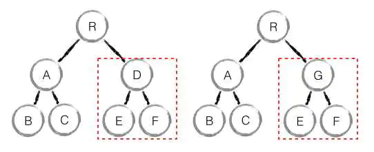

# React Diff Strategy

In React, the most significant feature is Virtual DOM which is based on Diff Algorithm.

By understanding diff in React, we are able to write a React Application with higher performance.

## Diff Strategy

The most easiest diff is to ergodic an tree by recursion as below:

```ts
const result = [];
// compare sub nodes
const diffLeafs = function (beforeLeaf, afterLeaf) {
    // get the max length of last tree and next tree
    let count = Math.max(beforeLeaf.children.length, afterLeaf.children.length);
    for (let i = 0; i < count; i++) {
        const beforeTag = beforeLeaf.children[i];
        const afterTag = afterLeaf.children[i];
        // add afterTag node
        if (beforeTag === undefined) {
            result.push({ type: "add", element: afterTag });
            // remove beforeTag node
        } else if (afterTag === undefined) {
            result.push({ type: "remove", element: beforeTag });
            // when node type has changed, removing beforeTag node, add afterTag node
        } else if (beforeTag.tagName !== afterTag.tagName) {
            result.push({ type: "remove", element: beforeTag });
            result.push({ type: "add", element: afterTag });
            // when node type is the same, changing its content
        } else if (beforeTag.innerHTML !== afterTag.innerHTML) {
            if (beforeTag.children.length === 0) {
                result.push({
                    type: "changed",
                    beforeElement: beforeTag,
                    afterElement: afterTag,
                    html: afterTag.innerHTML
                });
            } else {
                // recursion comparison
                diffLeafs(beforeTag, afterTag);
            }
        }
    }
    return result;
}
```

Its time complexity is O(n^3), which means it is too expensive to be used in practice.

React use its advanced diff strategy to reduce the time complexity to O(n), which is based on 3 strategy as below:

### Tree Diff

In practice, it's rare to operate DOM crossing its tree level.

In this way, when moving an element to another element in different level, React won't move the element, instead, React will remove it and recreate it. The process is as below:


tips:

- Keep the structure of DOM stable, changing the tree structure as less as possible.
- When we need to remove and add a node frequently, we can use CSS to hide it, instead of removing it from the DOM tree.

### Component Diff

React assumes that the same components will generate the same DOM structure, in contrast, different components will generate a different DOM structure.

The component like as below is that we need to avoid when we using React:



tips:

- use `shouldComponentUpdate` or `React.memo` (`PureComponent`) to avoid unnecessary rendering.
- UI with the similar structure can be wrote as a component.

### Element Diff

For elements they are in the one level and same list, they can be recognized by an unique key.

For those elements they changed their position, React use a principle `previousIndex > currentIndex => Not Move` to judge which elements need to be moved.


In this situation, all elements except D will be moved. Obviously, it's a huge cost of performance.

tips:

- add a real unique key in list.
- avoid to shift the last element in a list to the head.

### More Optimization

#### Don't use anonymous function in JSX

if writing anonymous function in JSX, every time React rerender, it will re-execute the anonymous function.

Because React uses `===` to compare `props`:

```js
(() => {}) === (() => {}); // false
```

`Function` object in JS is reference type, in this way, even the same anonymous function will be treated as different object to trigger re-execute.

## Reference

- <https://reactjs.org/docs/reconciliation.html>
- <https://www.jianshu.com/p/6e9c91c62d0f>
- <https://www.cronj.com/blog/diff-algorithm-implemented-reactjs/>
- <https://zhuanlan.zhihu.com/p/20346379>
