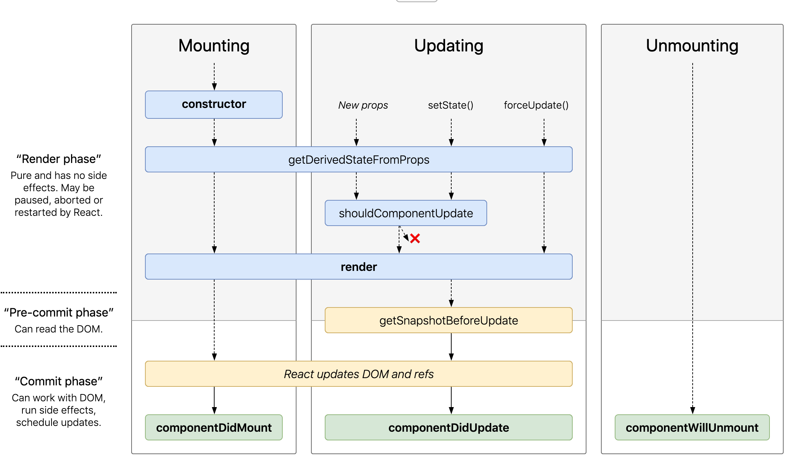

The first time I was exposed to the concept of Life Cycle is in the IOS. There is many 
life cycle in its different components. Android also has the equivalent.

Now, in Web development, React helps us to use it make develop Web application easier.

## constructor

In a class extends React.Component, constructor with `super` is imperative. `super` is a key word to 
instantiate properties that extend from parent class.

And `super` can also be an object like below:

```js
class A{
    constructor() {
        this.a = 1;
    }
    fn(){
        console.log(this.a);
    }
}

class B extends A{
    constructor(props){
        super(props);
        this.a = 2;
        super.fn()         //2, this.a points to current class
    }
}

let b = new B();
```

Also, in constructor, `this.state` can be declared.

## componentWillMount()

Before rendering, so the code in it will run in server side when using SSR. Normally, I will use it 
to do AJAX or data calculation. After React v16.3, this function is not safe for AJAX operation.

## componentDidMount()

After rendering finished, in it, real DOM is accessible, such as this.setState or get DOM by refs.

## componentWillUnmount()

The first time render finished will be operated.

## componentWillReceiveProps(nextProps)

When this.props is changing and before rendering again, it will be operated. In it, this.props is previous 
props and nextProps is new props. In 16.3, `getDerivedStateFromProps` is its replacement.

## static getDerivedStateFromProps(nextProps, prevState)

It is a static class function, when the updating of props will impact state
, return an object as new state to trigger rerender and return null to deny, like below:

```js
static getDerivedStateFromProps(nextProps, prevState){
    if (!equal(nextProps, prevState)){
        return {...prevState, ...nextProps};
    }
    return null;
}
```

## shouldComponentUpdate(nextProps, nextState)

return `false` to deny UI update. To check whether UI render is really imperative, it is an important way to 
avoid to redo unnecessary render, default is `true`.

## componentWillUpdate(nextProps, nextState)

After shouldComponentUpdate return `true` or call `forceUpdate`, it will be operated. If in it call `setState` will lead to repetitive cycle.
In React 16.3, `getSnapshotBeforeUpdate` is its replacement.

## getSnapshotBeforeUpdate(prevProps, prevState)

When updating, the render is finished, before rendering DOM, this function will be called. The return value will 
be `componentDidUpdate`'s `snapShot`.

## componentDidUpdate(prevProps, prevState, snapShot)

Except first render, every time render finished, this function will be called. Without conditions to use `this.setState` will lead to 
repetitive cycle in this function. Like:

```js
componentDidUpdate(prevProps, prevState, snapShot) {
    if(condition) {
        this.setState({...}) 
    } else {
        
    }
}
```

## React Fiber

In React Fiber, the code will be separated to many fragments. The operation has higher priority may break some of 
lower priority operation. So, some of life cycle in previous version, which would only operate one time, in new version, may 
operate more than once.

> componentWillMount <br />
> componentWillReceiveProps <br />
> shouldComponentUpdate <br />
> componentWillUpdate <br />

These 4 life cycles may be broken because of other higher priority operation. So AJAX operation is not safe 
in these life cycles anymore, multiple the same AJAX operations are a totally waste.

> componentDidMount <br />
> componentDidUpdate <br />
> componentWillUnmount <br />

Once starting, these 3 life cycles won't be broken. 

> componentWillReceiveProps <br />
> shouldComponentUpdate <br />

These 2 life cycles won't be impacted in React Fiber, because in old version, they will be operated more than one time too.

## Hooks

New concept in React v16.8, in my understanding, it is for Stateless Components to access life cycles in React. 
For some of simple components, hooks are more convenient and easy to reuse. For example:

```js
class Example extends React.Component {
  constructor(props) {
    super(props);
    this.state = {
      count: 0
    };
  }

  render() {
    return (
      <div>
        <p>You clicked {this.state.count} times</p>
        <button onClick={() => this.setState({ count: this.state.count + 1 })}>
          Click me
        </button>
      </div>
    );
  }
}
```

is equal to:

```js
import { useState } from 'react';

function Example() {
  const [count, setCount] = useState(0);

  return (
    <div>
      <p>You clicked {count} times</p>
      <button onClick={() => setCount(count + 1)}>
        Click me
      </button>
    </div>
  );
}
```

### useState

`useState` receives the original value of the state and return an array, whose first element is 
current state value and second one is the function to change this state.

### useEffect

For example:

```js
import { useState, useEffect } from 'react';

function Example() {
  const [count, setCount] = useState(0);

  // === both operated in componentDidMount and componentDidUpdate:
  useEffect(() => {
    // update title
    document.title = `You clicked ${count} times`;
  });

  return (
    <div>
      <p>You clicked {count} times</p>
      <button onClick={() => setCount(count + 1)}>
        Click me
      </button>
    </div>
  );
}
```

useEffect === `componentDidMount` + `componentDidUpdate` + `componentWillUnmount`, we don't have to write the same code in these 
3 functions.

There are more other hooks in [hook API](https://reactjs.org/docs/hooks-reference.html).

## End

There is a nice page to show it, from [react-lifecycle-methods-diagram](http://projects.wojtekmaj.pl/react-lifecycle-methods-diagram/).



Also, for the old version, there is a pretty good image from [link](https://ithelp.ithome.com.tw/articles/10187845).


If you want to make a right or have some questions, welcome to leave a message.


