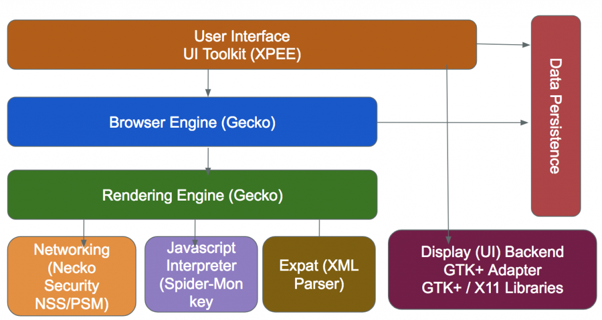
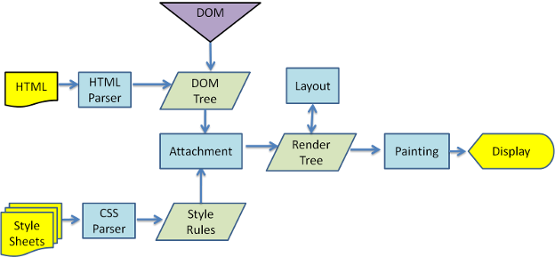

# Browser Rendering

## Browser Structure

Before talking about the steps of browser rendering, it's important to know modern browser's structure.

There is an image showing Firefox's structure:



Safari and Chrome use Webkit as their rendering engine instead of Gecko.

Safari uses JavaScriptCore as their JS engine, while Chrome use V8.

[Webkit](https://github.com/WebKit/webkit) is an open source rendering engine originally designed for Linux, and Apple transplanted it to Mac and Windows.

## Process

When a modern browser is rendering a html page, the main steps are as below:



As we can see, there are 5 main steps:

1. parse HTML to DOM Tree.
2. simultaneously, parse style files to style rules.
3. combine DOM Tree and style rules to Render Tree.
4. calculate layout and style, such as position, size, color.
5. render each Render Tree node in the screen.

## Block DOM parsing or rendering

When browser meets a `<script>` tag, it will block parsing DOM and next JS execution until the script is loaded. 

During this time, browser will render parsed DOM before this `<script>` in order to avoid wasting waiting time.

As a contrast, if browser meets a `<link>` tag, it will keep parsing DOM, block Render, block next execution of JS script, like as below:

```html
<!DOCTYPE html>
<html lang="en">
  <head>
    <title>web render block</title>
    <meta charset="UTF-8">
	<meta name="viewport" content="width=device-width, initial-scale=1">
	<script>
		var t1 = Date.now();
	</script>
    <link href="https://cdn.bootcss.com/bootstrap/4.0.0-alpha.6/css/bootstrap.css" rel="stylesheet">
  </head>
  <body>
	  <div>
		  <h1 class="text-primary">test</h1>
	  </div>
  </body>
  <script>
	// there will be a long time
	console.log(Date.now() - t1);
  </script>
</html>
```

If inspecting facebook's index html file, we can see most of `<link>` are put ahead of `<body>`, and most of `<script>` are on the bottom.

The reason is tha `<script>` block DOM parsing, `<link>` is not.

## CSS import without blocking rendering

Firstly, setting `link`'s `media` as `none`, this property can guarantee this CSS can be loaded without blocking rendering.

Next, when it is loaded, setting the `media` to `all`. Like as below:

```html
<!DOCTYPE html>
<html lang="en">
  <head>
    <title>web render block</title>
    <meta charset="UTF-8">
	<meta name="viewport" content="width=device-width, initial-scale=1">
	<script>
		var t1 = Date.now();
	</script>
	<link 
		href="https://cdn.bootcss.com/bootstrap/4.0.0-alpha.6/css/bootstrap.css" 
		rel="stylesheet"
		media="none"
		onload="this.media='all'"
	/>
  </head>
  <body>
	  <div>
		  <h1 class="text-primary">test</h1>
	  </div>
  </body>
  <script>
	console.log(Date.now() - t1);
  </script>
</html>
```

- Notice: It may lead screen's style rules to change multiple times in a short time. 

## JS import without blocking DOM parsing

We can two properties `async` and `defer` to control it. Their differences are as below:


## Reflow and Repaint

Reflow, or Relayout, means the size of node has been changed, therefore the render engine needs to recalculate a large part of or total Render Tree.

Repaint, such as set `visibility: hidden` or change font color, doesn't include the change of size, which means it will only impacts a part of Render Tree, not involve others.

In some cases, such as changing elements' style at batch, browser will accumulate the operations changing element's style, and execute them at once, which is called increment reflow or asynchronize reflow.

## `DOMContentLoaded` and `load`

- The `DOMContentLoaded` event fires when the initial HTML document has been completely loaded and parsed, without waiting for stylesheets, images, and subframes to finish loading.

- The `load` event is fired when the whole page has loaded, including all dependent resources such as stylesheets and images. 

## Reference

- <https://developer.mozilla.org/en-US/docs/Web/Performance/How_browsers_work>
- <https://developers.google.com/web/fundamentals/performance/critical-rendering-path/render-blocking-css>
- <https://cloud.tencent.com/developer/article/1370715>
- <https://developer.mozilla.org/en-US/docs/Web/API/Window/DOMContentLoaded_event>
