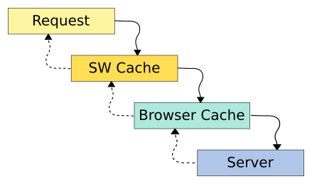
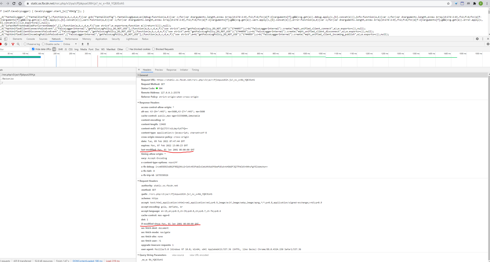
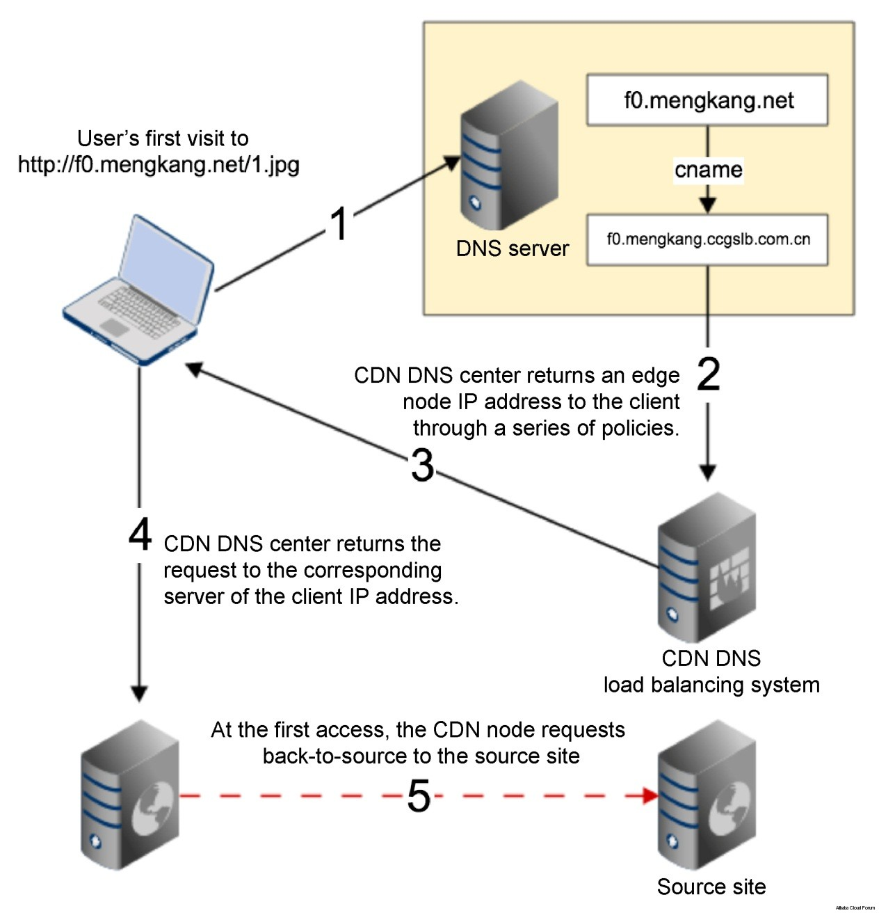

# Web Cache

## Remote Resource Cache

Caching is one of the most important way to improve the FP response time of Web Applications.

Nowadays, We have multiple ways to control it.

Traditionally, we can control web caching by Http caching. 

The order of a request passing web cache methods is as below:

### SW caching

Along with emergence of ES6, SW is a newer and more powerful way to do it, if ignoring its compatibility.

It can proxy whole requests to check whether needs to update by [caches](https://developer.mozilla.org/en-US/docs/Web/API/ServiceWorkerGlobalScope/caches), see more in my blog [Service Worker](https://github.com/Bert0324/js-playground/blob/master/web/service_worker.md).

### Http caching

Http caching is to use Http headers to control browser resource's cache. There are some steps how browsers to do it:

1. search in Browser cache

First, the browser will find in its cache by the file's name and cache mark.

If found, browser will directly return the file, if not, browser send a request to the server.

For example, Chrome will get the cache from the memory or disk like below:

There are some headers can be cache mark:

- `Expires`

From Http/1.0.

The Expires header contains the date/time after which the response is considered stale.

Invalid dates, like the value 0, represent a date in the past and mean that the resource is already expired.

If there is a Cache-Control header with the "max-age" or "s-max-age" directive in the response, the Expires header is ignored.

- `Cache-Control`

From Http/1.1.

The Cache-Control general-header field is used to specify directives for caching mechanisms in both requests and responses.

Caching directives are unidirectional, meaning that a given directive in a request is not implying that the same directive is to be given in the response.

See document in [MDN](https://developer.mozilla.org/en-US/docs/Web/HTTP/Headers/Cache-Control).

2. check cache with server

If the browser can find the file, but its cache mark shows it has already expired, the browser will send a request with the cache information of the resource.

The server will make the decision whether to use cached resource.

If the cache has already expired, the server will response 200 with new resource. In contrast, if it is not modified, the server will response 304.

And how do the server make the logical judgement to whether the cache is expired, the http headers it used is as below:

- `Last-Modified` and `If-Modified-Since`

`Last-Modified` indicates the last modified time of the resource, the server will send the header with the response.

And When the next time the client decide to request the resource again, `If-Modified-Since` will be sent with the request. The value is the same as `Last-Modified`.

An example from facebook static resource site:

- `ETag` and `If-None-Match`

Although `Last-Modified` and `If-Modified-Since` is able to cover most of cache situations, they have limits as below:

    1. When the resource content has been modified, but we don't want the client to GET it again.
    2. The modified time accuracy is under second, as `Last-Modified` can only accurate to second.
    3. When the server cannot get the modified time of the resource

In this way, we can use `ETag` and `If-None-Match`.

`ETag` is relative to files' content, such as content hash, or relative to its modified time. And in next request, its value will be sent in `If-None-Match`.

### CDN

The full name is Content Delivery Network. It can disperse traffic from the source server and optimize network load.

There are its steps:

1. First, keep statistics of the access logs of the original domain name to get the addresses of frequently-accessed
images , and hand over the addresses to the CDN service provider.

2. Let the CDN service provider capture the resources of the 200,000 addresses as a warm-up.

3. After the warm-up, we replace original ip address to CDN server address, and conduct CNAME resolution
to the provided domain name address of the CDN server.

4. Test whether the images under CDN server which can be cached by the CDN using the wgettool.

5. If the cache is okay through testing, we then switch part of the traffic to CDN server.

## Local Cache

1. key-value storage

If we want to save some of key-value data, localStorage and sessionStorage can be our choices. They both have `get` and `set` function for saving and getting data.

- `localStorage`

The localStorage can save string data permanently, its capacity is about 5MB.

- `sessionStorage`

The sessionStorage can save data until the tab is closed, its capacity is about 5MB.

2. IndexedDB

IndexedDB is a large-scale, NoSQL storage system. It lets you store just about anything in the user's browser.

Compared to `localStorage`, IndexedDB:

    1. mostly asynchronous
    2. supported to access the data from same domain
    3. can save an object instead of only string
    4. its capacity is about 250MB, or without limitation

3. cookie

cookie also can save some key-value data, although it is not a good way.
